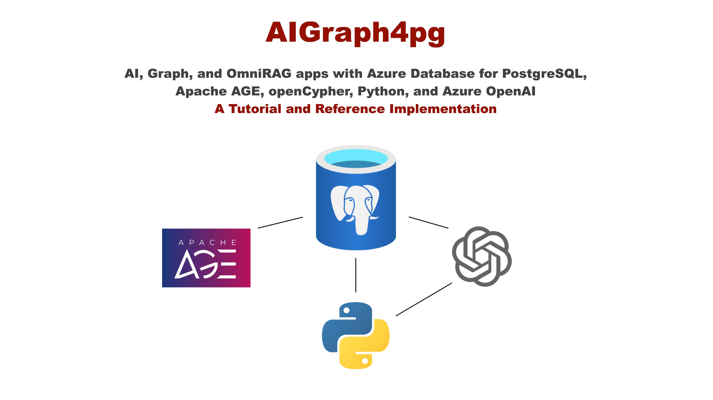
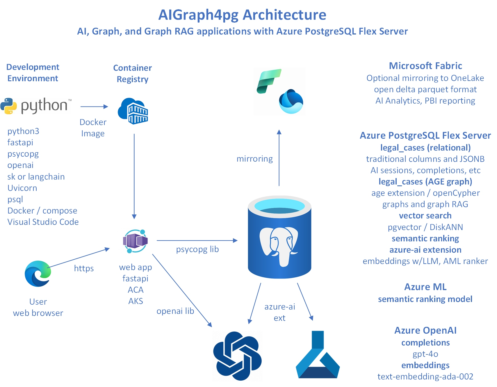

## Documentation

Please see the [Documentation site](https://cjoakim.github.io/AIGraph4pg/)

---

<p align="center">
  
</p>

---

<p align="center">
  
</p>

---

## Directory Structure of this GitHub Repository

```
Directory/File             Description

├── az                     az CLI deployment script for Azure PostgreSQL
├── data
│   └── legal_cases        Zipped curated dataset files for both relational and graph data
├── docs                   User documentation
└── python                 The Python-based implementation
    ├── config             Contains file sample_queries.txt, used by the Web UI
    ├── sql                Miscellaneous SQL, DDL, indexing scripts
    ├── src                The primary Python source code
    ├── static             Static assets used in the Web app
    ├── templates          Jinja2 templates used in text generation
    ├── tests              Unit tests
    ├── views              Web app HTML views/templates, including tutorial_<topic>.html pages
    ├── main.py            The "console app" part of this application
    ├── requirements.in    The base list of Python requirements, used by venv.ps1/venv.sh
    ├── venv.ps1           Windows PowerShell script to create the Python virtual environment
    ├── venv.sh            Linux/macOS script to create the Python virtual environment
    ├── webapp.py          The Web application, built with the FastAPI framework
    ├── webapp.ps1         Windows PowerShell script to start the Web app
    └── webapp.sh          Linux/macOS script to start the Web app
└── mkdocs*                Files related to html documentation generation with mkdocs
                           published to GitHub pages site https://cjoakim.github.io/AIGraph4pg/
```
