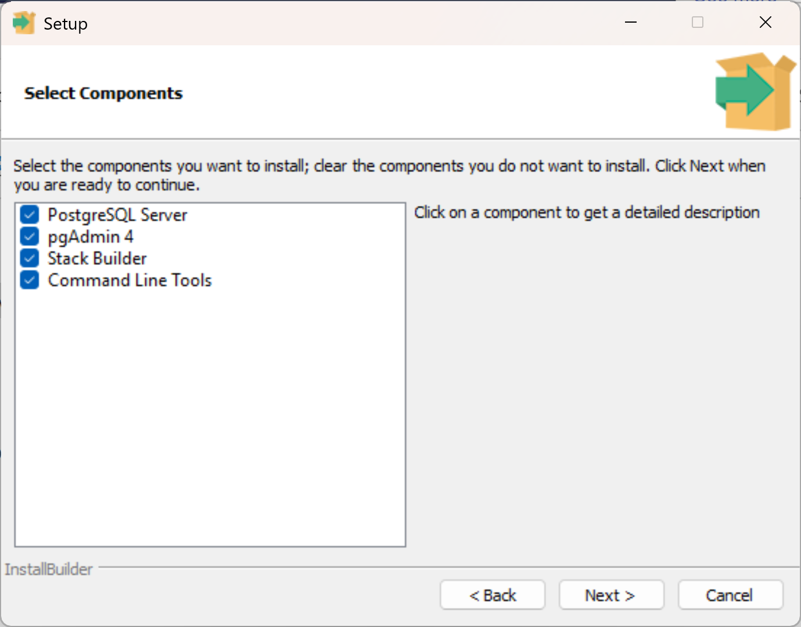
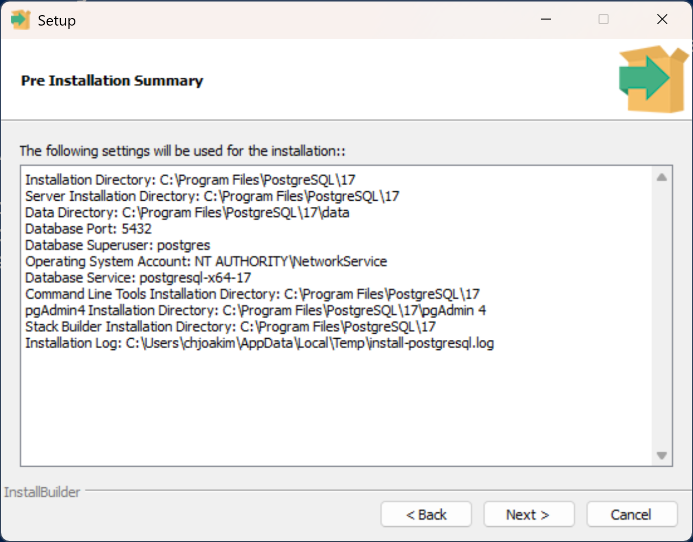
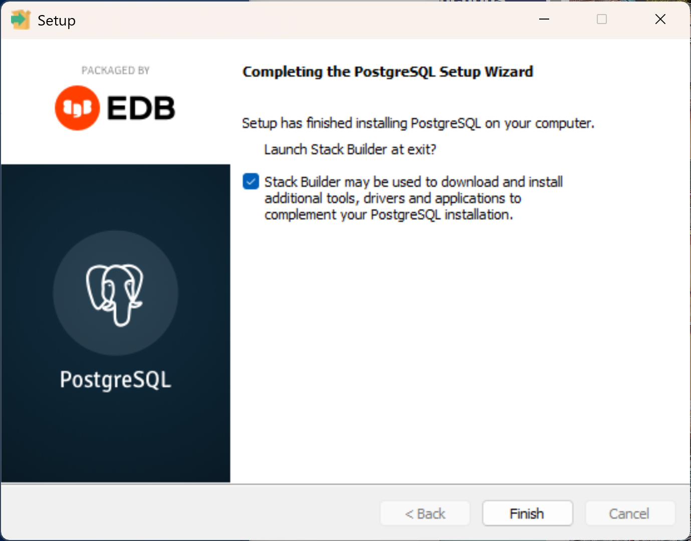

# AIGraph4pg : Local PostgreSQL Installation

It is recommended that you install the latest version of PostgreSQL
on your workstation/laptop both as a learning tool, and also
to install the **psql** command line program that is used
in this reference application.

The [psql](https://www.postgresql.org/docs/current/app-psql.html)
program is a terminal-based front-end to PostgreSQL that can be
used both interactively and in batch command mode.
**You can use psql to connect to any PostgreSQL database - including Azure PostgreSQL.**

It only takes a few minutes to download and install PostgreSQL.

Visit URL https://www.postgresql.org/download/ with your web browser
to see information about the available installations.

The installer program for your OS (Windows, macOS, Linux) can be downloaded from this
[EDB page:](https://www.enterprisedb.com/downloads/postgres-postgresql-downloads).

Simply download the installer program and double-click it to execute it.
You'll be guided through several screens in the installer program that look
like the following.

<p align="center">
  
</p>

Select all four checkboxes and click Next.

---

<p align="center">
  
</p>

Note the location of the installation path and click Next.

---

<p align="center">
  
</p>

The Stack Builder step is optional; it is not necessary
for this reference application.

---

After the installer program completes you will need to add the
PostgreSQL bin directory to your PATH environment variable by
following these steps:

- In the Windows 11 Taskbar, type **env** in the Search field and click Enter.
- This will launch the System Properties UI
- Click the 'Environment Variables' button
- In the Environment Variables dialog select PATH in the User variables list and click Edit
- In the Edit Environment Variable dialog, click New
- Add the PostgreSQL bin path; C:\Program Files\PostgreSQL\16\bin
- Click Ok to all three dialogs in sequence to save your changes

### Verify the installation

After the installer program completes, and you have updated your PATH
environment variable, open a **new** PowerShell window and enter 
the **psql** command.

```
> psql --help

psql is the PostgreSQL interactive terminal.
... 
```

If you see the help content that starts with the above output
then you have installed PostgreSQL successfully.
