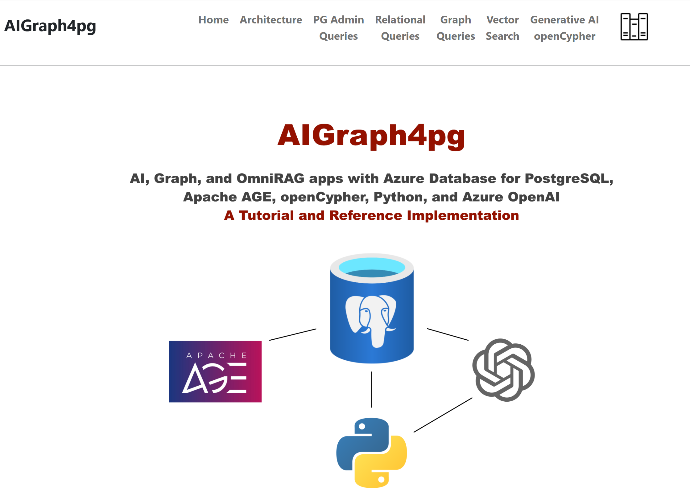

# 3.0 AIGraph4pg - Quick Start Documentation

These instructions are intended to help you deploy Azure PaaS Services
and run this reference application on your workstation.

## 3.1 Recommended Skills

- Some programming language experience, especially with Python 3
- Some understanding of Python virtual environments
- Some understanding of Environment Variables
- Some command-line experience, Windows PowerShell or linux/macOS bash shell

There will be several steps to execute in this Quick Start,
**it is not a "one-click" deploy**.

---

## 3.2 Workstation Requirements

- **Windows 11** or recent **Linux** or **macOS** desktop operating system
- The **git** source-control system. See https://git-scm.com/
- The **Azure CLI** (i.e. - az).  See https://learn.microsoft.com/en-us/cli/azure/
- An **Azure Subscription**
- **Standard Python 3.12.x**; not Conda or other distributions.  See https://www.python.org/downloads/
- **Visual Studio Code (VSC)** or similar IDE/editor.  See https://code.visualstudio.com/
- **A PostgreSQL client program, such as psql**.  See https://www.postgresql.org/docs/current/app-psql.html
- **A local/desktop PostgreSQL database installation**.  This is optional, but useful for learning the basics of PostgreSQL
- **Docker Desktop**.  Optional, used only for executing the public DockerHub image.

---

## 3.3 Azure PaaS Services to Deploy

### 3.3.1 Azure PostgreSQL

- See the **az/** directory in this repo
- Copy file **az/provision-config-example.json** to **az/provision-config.json**
- Edit the **az/provision-config.json** per your subscription.  The entry names are self-explanatory
- Execute **az login**.  See https://learn.microsoft.com/en-us/cli/azure/authenticate-azure-cli
- Execute the **az/provision.ps1** script to provision your Azure PostgreSQL server
- Alternatively, provision this manually in Azure Portal.
- Enable the VECTOR and AGE extensions.
See https://learn.microsoft.com/en-us/azure/postgresql/flexible-server/concepts-extensions

This reference application assumes that the name of your database is **dev**.


### 3.3.2 Azure OpenAI

- Recommended, for this project, to provision this manually in Azure Portal
- Create a **text-embedding-ada-002** model deployment, for embeddings and vector search
- Create a **gpt-4o** model deployment, for generative AI of openCypher queries

---

## 3.4 A Note on Windows PowerShell and macOS bash Terminal

The remaining instructions on this page describe how you should
execute **command-line** commands in either Windows PowerShell
or the macOS Terminal program with the bash shell.  These instructions
are primarily Windows-based, but macOS is supported, too.

In the remaining documentation on this page, the relative directory
location is shown for your reference.  For example, in Windows PowerShell, 
when you are in the **root directory** of the GitHub project you'll
see instructions like this:

```
AIGraph4pg> some command in the root directory
```

Likewise, when you're in the **python directory** beneath the AIGraph4pg 
directory, the instructions will look like this:

```
python> some command in the python directory
```

The project directory structure looks like this:

```
├── az
├── data
│   ├── cypher               <-- curated list of statements to populate the Apache AGE graph
│   └── pypi
│       └── wrangled_libs    <-- the curated libraries dataset, pre-vectorized
├── docs
│   └── img
└── python
    ├── docker               <-- Dockerfile and docker-compose.yml
    ├── sql                  <-- DDL and SQL files for psql and python logic
    ├── src                  <-- Python source code
    │   ├── models
    │   ├── services
    │   └── util
    ├── static               <-- static files used by the Web UI application
    ├── templates            <-- jinga2 text templates 
    ├── tests                <-- Unit tests built on the pytest framework
    ├── venv                 <-- The Python virtual environment, not in Git (git ignored)
    └── views                <-- Web UI HTML page templates
```

```
├── az
├── data
│   ├── countries
│   └── legal_cases
│       ├── graph_csv
│       └── work
├── docs
│   ├── img
│   └── pdf
├── jupyter
├── mkdocs_overrides
│   └── partials
├── pg_scripts
└── python
    ├── __pycache__
    ├── config
    ├── sql
    ├── src
    │   ├── __pycache__
    │   ├── models
    │   ├── services
    │   └── util
    ├── static
    │   ├── img
    │   └── pdf
    ├── templates
    ├── tests
    ├── tmp
    ├── venv
    │   ├── bin
    │   ├── include
    │   └── lib
    └── views
```

---

## 3.5 Set the Environment Variables for this project

Per the [Twelve-Factor App methodology](https://12factor.net/config),
configuration is stored in environment variables.  

### 3.5.1 List of enviroment variables

This reference implementation uses the following environment variables.
They begin with the prefix **AIG4PG_**.

| Name | Description |
| --------------------------------- | --------------------------------- |
| AIG4PG_LLM_CONTEXT_MAX_NTOKENS | Optional.  Defaults to 0, no truncation. |
| AIG4PG_LOG_LEVEL | See values in class LoggingLevelService - notset, debug, info, warning, error, or critical |
| AIG4PG_OPENAI_COMPLETIONS_DEP | The name of your Azure OpenAI completions deployment |
| AIG4PG_OPENAI_EMBEDDINGS_DEP | The name of your Azure OpenAI embeddings deployment |
| AIG4PG_OPENAI_KEY | The Key of your Azure OpenAI account |
| AIG4PG_OPENAI_URL | The URL of your Azure OpenAI account |
| AIG4PG_PG_AGE_GRAPH_NAME | The name of the PostgreSQL AGE graph |
| AIG4PG_PG_FLEX_DB | Azure PostgreSQL Flex Server database |
| AIG4PG_PG_FLEX_PASS | Azure PostgreSQL Flex Server user password |
| AIG4PG_PG_FLEX_PORT | Azure PostgreSQL Flex Server port |
| AIG4PG_PG_FLEX_SERVER | Azure PostgreSQL Flex Server hostname |
| AIG4PG_PG_FLEX_USER | Azure PostgreSQL Flex Server user |
| LOCAL_PG_PASS | Optional.  Used by the psql.ps1/psql.sh scripts for local PostgreSQL access |

### 3.5.2 Setting these Environment Variables

The repo contains generated PowerShell script **set-env-vars-sample.ps1**
which sets all of these AIG4PG_ environment values.
You may find it useful to edit and execute this script rather than set them manually on your system


### 3.5.3 python-dotenv

The [python-dotenv](https://pypi.org/project/python-dotenv/) library is used
in  this implementation.  It allows you to define environment variables in a
file named **`.env`** and thus can make it easier to use this project during local development.

Please see the **dotenv_example** files in each subapplication for examples.

It is important for you to have a **.gitignore** entry for the **.env** file
so that application secrets don't get leaked into your source control system.

--- 

## 3.6 Clone the GitHub repo and create the Python Virtual Environment

These are one-time tasks in the use of this project.

### 3.6.1 Clone the Repo

This will copy the code, scripts, and curated data files to your computer.

```
> cd some-parent-directory-on-your-computer

> git clone https://github.com/cjoakim/aigraph4pg.git

> cd AIGraph4pg    <-- navigate into the project root directory
```

### 3.6.2 Create the Python Virtual Environment

A Python Virtual Environment is an isolated location on your computer
containing a well-defined set of required libraries, defined in the 
**requirements.in** file.  The libraries are downloaded from [PyPi](https://pypi.org/).
The application code in this project then uses these Python libraries.

This is conceptually similar to NuGet (DotNet ecosystem), MavenCentral (Java ecocystem),
NPM (Node.js and JavaScript ecosystem), etc..

```
AIGraph4pg> cd python       

python>                   <-- You'll primarily use this directory in this project

python> .\venv.ps1

python> pip list          <-- pip is the library installer program; you'll see smilar output below

Package                              Version
------------------------------------ -----------
aenum                                3.1.15
agefreighter                         0.7.5
ageqrp                               0.1.0
     ... many lines omitted here ...
wsproto                              1.2.0
yarl                                 1.16.0
zipp                                 3.21.0
```

### 3.6.3 Activate the Python Virtual Environment (venv)

**Each time** you navigate to the python directory of this project
and want to execute a python program you will need to **"activate"** the
virtual environment, as shown below:

Notice how when the Virtual Environment is activated your shell
prompt changes to have the **(venv)** prefix.
This is a useful visual cue.

### 3.6.4 Windows 11 PowerShell

```
PS ...\python>
PS ...\python> .\venv\Scripts\Activate.ps1
(venv) PS ...\python>
```

If you find this tedious to type often, you can optionally create an alias
in your **Microsoft.PowerShell_profile.ps1** file like the following.

```
New-Alias va .\venv\Scripts\activate
```

With this alias, you simply have to type **va** (i.e - virtualenv activate)
instead of typing out ".\venv\Scripts\Activate.ps1".

See https://learn.microsoft.com/en-us/powershell/scripting/learn/shell/creating-profiles?view=powershell-7.5

### 3.6.5 macOS bash shell

```
[~/AIGraph4pg]$ cd python
[~/AIGraph4pg/python]$ source venv/bin/activate
(venv) [~/AIGraph4pg/python]$
```

---

## 3.7 Prepare your Azure PostgreSQL Server

In a **Windows PowerShell** window navigate to the python\ directory of this repo,
execute the following command to connect to the **postgres**
database in your Azure PostgreSQL server.

```
.\pg.ps1 flex postgres
```

This will put you into a **psql** terminal, connected to your Azure PostgreSQL
server, per the several AIG4... environment variables you set above.
Alternatively, you can use a desktop UI such as **pgAdmin4** for these commands,
but the documentation here assumes psql.

Your terminal prompt should now look like this, indicating that you are connected
to the postgres database, and psql is awaiting a command.

```
postgres=>
```

Next, confirm the user, database, and host your psql terminal is connected to.

```
postgres=> \conninfo
You are connected to database "postgres" as user "chjoakim" on host ...
```

You can see the list of users with the **\du** command:

```
postgres=> \du
                                List of roles
   Role name    |                         Attributes
----------------+------------------------------------------------------------
 azure_pg_admin | Cannot login
 azuresu        | Superuser, Create role, Create DB, Replication, Bypass RLS
 chjoakim       | Create role, Create DB, Bypass RLS
 replication    | Replication
```

You can create and alter additional database users with these commands.
In these examples, elsa is the user ID.

```
postgres=> create role elsa with createdb login password '<secret>';
postgres=> alter user elsa with password '<new-password>';
```

Next, list the databases in the server.

```
postgres=> SELECT datname FROM pg_catalog.pg_database;
      datname
-------------------
 azure_maintenance
 template1
 postgres
 azure_sys
 template0
 dev
(6 rows)
```

If the **dev** database is not present, create it as shown here.
Replace chjoakim with your ID.

```
postgres=> create database dev owner chjoakim;
```

## 3.7.1 Configure the dev database

First, switch to the dev database with this command.
Notice how the prompt changes to 'dev->'/

```
postgres=> \connect dev
You are now connected to database "dev" as user ...
dev=>
```

Enable the four PostgreSQL extensions that we'll use in this application
with the **CREATE EXTENSION** command.

If you created your Azure PostgreSQL server manually, rather than
with the az CLI script in this repo, you'll first have to enable
these extensions as shown in this screen shot:

TODO - screen shot

```
dev=> CREATE EXTENSION IF NOT EXISTS age CASCADE;
CREATE EXTENSION

dev=> CREATE EXTENSION IF NOT EXISTS vector CASCADE;
CREATE EXTENSION

dev=> CREATE EXTENSION IF NOT EXISTS PG_DISKANN CASCADE;
CREATE EXTENSION

dev=> CREATE EXTENSION IF NOT EXISTS AZURE_AI CASCADE;
CREATE EXTENSION
```

Verify that these extensions are created with this query.
You should see similar output.

```
dev=> SELECT oid, extname FROM pg_extension order by extname;
  oid  |  extname
-------+------------
 25081 | age
 25687 | azure_ai
 25668 | pg_diskann
 14258 | plpgsql
 24760 | vector
(5 rows)
```

This is a similar query:

```
dev=> show azure.extensions;
        azure.extensions
--------------------------------
 AGE,VECTOR,PG_DISKANN,AZURE_AI
(1 row)
```

## 3.7.2 Configure the dev database for Apache AGE graphs

To make AGE functionality easier to use for a given user,
you can set their default **search_path** as shown below.
Replace chjoakim with your ID.

```
dev=> alter user chjoakim set search_path='public','ag_catalog',"$user";
ALTER ROLE
```

You can list the AGE graphs with this query.
It should initially return zero rows.

```
dev=> SELECT * FROM ag_catalog.ag_graph;
 graphid | name | namespace
---------+------+-----------
(0 rows)
```

Create the Apache AGE **legal_cases** graph, enter this command:

```
dev=> SELECT ag_catalog.create_graph('legal_cases');
```

List the AGE graphs again, and legal_cases should be in the list.

```
dev=> SELECT * FROM ag_catalog.ag_graph;
 graphid |    name     |  namespace
---------+-------------+-------------
   25768 | legal_cases | legal_cases
(1 row)
```

This graph can be dropped at a later date with this command,
but don't do this now.

```
dev=> SELECT * FROM ag_catalog.drop_graph('legal_cases', true);
```

You can quit and close the psql program with the **\q** command.
Notice how it puts you back into the original python\ directory
and the virtual environment is activated as indicated with the (venv)
prompt prefix.

```
dev=> \q
(venv) PS ...\python>
```

---

## 3.8 Load Azure PostgreSQL with the Python Libraries Dataset

The dataset is a curated set of information on 10,000+ **Python Libraries**
from web crawling and other tools.  This dataset provides a foundation to
demonstrate both **traditional graph** as well as **vector search**
capabilities in Azure PostgreSQL.

The Python libraries have both dependencies and authors, and this graph
can be traversed.  Likewise, Python library data has rich text fields
(descriptions, keywords) that showcase vector search.

It is hoped that this dataset is relatable to an IT audience, particularly
application developers, and data scientists.

### 3.8.1 main.py

This is the Python program (i.e. - *.py suffix) that implements the
**"console app"** in this project.  You can see its **help content**
by executing the following command.  You should see similar output
though some lines have been omitted in this documentation.

```
(venv) PS ...\python> python main.py help
...
Usage:
    python main.py log_defined_env_vars
    python main.py list_pg_extensions_and_settings
    python main.py delete_define_legal_cases_table
    python main.py query_legal_cases_table
    python main.py relational_search_case_id 594079
    python main.py load_age_graph_with_agefreighter <graph-naame> <do-load-bool>
    python main.py load_age_graph_with_agefreighter legal_cases_af1 true
    python main.py execute_graph_validation_queries legal_cases_af1
    python main.py vector_search_similar_cases 594079 10
    python main.py vector_search_words word1 word2 word3 etc
    python main.py vector_search_words Woolworth Co. v. City of Seattle
```

Display the several **AIG4... environment variables** with this command.
Visually validate that they are correct (i.e. - pointing to your
Azure PostgreSQL server, your Azure OpenAI service, etc.).

```
(venv) PS ...\python> python main.py log_defined_env_vars
... output not shown here ...
```

Edit and execute the **set-env-vars-sample.ps1** script if the 
environment variables have no values, or incorrect values.

### 3.8.2 main.py - delete_define_libraries_table

Delete and recreate (i.e. 'delete-define') the legal_cases relational table
with the following command.  It uses file **python/sql/legal_cases_ddl.sql**
in the repo.

```
python> python .\main.py delete_define_legal_cases_table
```

In **psql** you can verify that the table and related indexes 
were created with the **\d** command.

```
dev=> \d legal_cases
                                          Table "public.legal_cases"
      Column       |          Type           | Collation | Nullable |                 Default
-------------------+-------------------------+-----------+----------+-----------------------------------------
 id                | bigint                  |           | not null | nextval('legal_cases_id_seq'::regclass)
 name              | character varying(1024) |           |          |
 name_abbreviation | character varying(1024) |           |          |
 case_url          | character varying(1024) |           |          |
 decision_date     | date                    |           |          |
 court_name        | character varying(1024) |           |          |
 citation_count    | integer                 |           |          |
 text_data         | text                    |           |          |
 json_data         | jsonb                   |           |          |
 embedding         | vector(1536)            |           |          |
Indexes:
    "legal_cases_pkey" PRIMARY KEY, btree (id)
    "idx_legal_cases_citation_count" btree (citation_count)
    "idx_legal_cases_court_name" btree (court_name)
    "idx_legal_cases_decision_date" btree (decision_date)
    "idx_legal_cases_diskann_embedding" diskann (embedding vector_cosine_ops)
    "idx_legal_cases_json_data_gin" gin (json_data)
    "idx_legal_cases_name_abbreviation" btree (name_abbreviation)
```

### 3.8.3 psql copy into the legal_cases table

The COPY protocol is very fast and efficient in PostgreSQL.
We use it here to load the curated dataset in the repo.

Since this curated dataset is large, it is stored in the GitHub
repo as a zip file: **data/legal_cases/legal_cases.zip**.

One way to do this is with **Windows Explorer**, select the zip file,
right mouse, then Extract All... 
Alternatively, if you have Java installed, you can use the jar command.

```
PS ...\legal_cases> jar tvf .\legal_cases.zip
155009537 Mon Dec 09 10:48:22 EST 2024 legal_cases.sql
PS ...\legal_cases> jar xvf .\legal_cases.zip
 inflated: legal_cases.sql
```

The unzipped file is **legal_cases.sql**, which is used in the following
COPY command in **psql**:

```
dev=> \copy legal_cases FROM '<fully-qualiied-filename>' DELIMITER E'\t'
```

Your fully-qualiied-filename might look like the following.
This output indicates that 2679 rows were loaded into the table.

```
dev=> \copy legal_cases FROM C:\Users\chjoakim\github\AIGraph4pg\data\legal_cases\legal_cases.sql DELIMITER E'\t'
COPY 2679
```

Execute this query in psql to confirm that the table does indeed contain 2679 rows.

```
dev=> select count(*) from legal_cases;
 count
-------
  2679
(1 row)
```

### 3.8.5 Load the legal_cases AGE graph

This process is executed with python, rather than psql, with the
following command:

```
(venv) PS ...\python> python main.py load_age_graph_with_agefreighter legal_cases true
2025-02-09 16:55:26,176 - Running on Windows, setting WindowsSelectorEventLoopPolicy
2025-02-09 16:55:26,177 - DBService#initialze_pool creating new...
...
2025-02-09 16:55:26,683 - AGEGraphLoader#load_legal_cases_dataset: legal_cases True
2025-02-09 16:55:26,683 - freighter: <agefreighter.multicsvfreighter.MultiCSVFreighter ...
2025-02-09 16:55:29,186 - freighter loaded
2025-02-09 16:55:29,186 - closing freighter...
2025-02-09 16:55:29,187 - closed
2025-02-09 16:55:29,187 - AGEGraphLoader#execute_validation_queries: legal_cases
2025-02-09 16:55:29,187 - DBService#execute_query, stmt: select graphid, name, namespace from ag_catalog.ag_graph order by graphid;
[33836, 'legal_cases', 'legal_cases']
2025-02-09 16:55:29,253 - DBService#execute_query, stmt: select * from ag_catalog.cypher('legal_cases', $$ MATCH (n) RETURN count(n) as count $$) as (v agtype);
2679
2025-02-09 16:55:29,324 - DBService#execute_query, stmt: select * from ag_catalog.cypher('legal_cases', $$ MATCH ()-[r]->() RETURN count(r) as count $$) as (e agtype);
15998
2025-02-09 16:55:29,418 - DBService#execute_query, stmt: select * from ag_catalog.cypher('legal_cases', $$ MATCH (c) RETURN c limit 3 $$) as (v agtype);
{'id': 844424930131969, 'label': 'Case', 'properties': {'id': '1017660', 'name': 'United Mutual Savings Bank v. Riebli', 'court': 'Washington Supreme Court', 'case_url': 'https://static.case.law/wash-2d/55/cases/0816-01.json', 'decision_year': '1960', 'citation_count': '14'}}
{'id': 844424930131970, 'label': 'Case', 'properties': {'id': '594079', 'name': 'Martindale Clothing Co. v. Spokane & Eastern Trust Co.', 'court': 'Washington Supreme Court', 'case_url': 'https://static.case.law/wash/79/cases/0643-01.json', 'decision_year': '1914', 'citation_count': '5'}}
{'id': 844424930131971, 'label': 'Case', 'properties': {'id': '552848', 'name': 'Lynch v. Ninemire Packing Co.', 'court': 'Washington Supreme Court', 'case_url': 'https://static.case.law/wash/63/cases/0423-01.json', 'decision_year': '1911', 'citation_count': '7'}}
2025-02-09 16:55:29,489 - DBService#execute_query, stmt: select * from ag_catalog.cypher('legal_cases', $$ MATCH ()-[r]-() RETURN r limit 3 $$) as (r agtype);
{'id': 1125899906842625, 'label': 'cites', 'end_id': 844424930131970, 'start_id': 844424930131969, 'properties': {'case_id': '1017660', 'other_id': '1960', 'case_year': '594079', 'other_year': '1914'}}
{'id': 1407374883553281, 'label': 'cited_by', 'end_id': 844424930131969, 'start_id': 844424930131970, 'properties': {'case_id': '594079', 'other_id': '1914', 'case_year': '1017660', 'other_year': '1960'}}
{'id': 1125899906842626, 'label': 'cites', 'end_id': 844424930131971, 'start_id': 844424930131969, 'properties': {'case_id': '1017660', 'other_id': '1960', 'case_year': '552848', 'other_year': '1911'}}
2025-02-09 16:55:29,558 - DBService#close_pool, closing...
2025-02-09 16:55:29,558 - DBService#close_pool, closed
```

This output shows that **2679 vertices and 15998 edges** were loaded into the graph.

The output also contains several validation queries which display several
vertices and edges in the AGE graph.

This Apache AGE graph loading functionality is implemented here with the
[agefreighter](https://pypi.org/project/agefreighter/) python library.
Notice how the above loading of 2679 vertices and 15998 edges only took
**2.503 seconds** from a laptop and home network (pertinent log lines shown below).

```
2025-02-09 16:55:26,683 - freighter: <agefreighter.multicsvfreighter.MultiCSVFreighter ...
2025-02-09 16:55:29,186 - freighter loaded
```

---

## 3.9 Run the Web Application on your computer

Now that you've loaded both the relational and Apache AGE graph data
into your Azure PostgreSQL server, you can access it with a web application
which provides a User Interface (UI).

The web application is intended to run locally, but you may wish to 
deploy it to Azure, such as to Azure Container Apps (ACA).
This deployment process is easy, but is out-of-scope for this 
tutorial and reference application.  You can read more about 
Azure Container Apps here: https://learn.microsoft.com/en-us/azure/container-apps/ 

### 3.9.1 Run as a Python process

Simply run the **webapp.ps1** script in the \python directory as shown below:

```
(venv) PS ...\python> .\webapp.ps1
activating the venv ...
Python 3.12.9
2025-02-10 09:35:41,406 - Windows platform detected, setting WindowsSelectorEventLoopPolicy
2025-02-10 09:35:41,407 - webapp.py started
2025-02-10 09:35:43,920 - Windows platform detected, setting WindowsSelectorEventLoopPolicy
2025-02-10 09:35:43,921 - webapp.py started
2025-02-10 09:35:43,926 - log_defined_env_vars: {
  "AIG4PG_LLM_CONTEXT_MAX_NTOKENS": "10000",
  "AIG4PG_LOG_LEVEL": "info",

...

2025-02-10 09:35:44,301 - DBService#initialze_pool, pool opened
[2025-02-10 09:35:44 -0500] [6880] [INFO] Running on http://127.0.0.1:8000 (CTRL + C to quit)
2025-02-10 09:35:44,752 - Running on http://127.0.0.1:8000 (CTRL + C to quit)
```

You should see logging output similar to the above.

Visit **http://127.0.0.1:8000** with your browser.  You should then see the
home page of the UI

### 3.9.2 Run as a Docker container

This UI application can also be executed as a Docker container
on your desktop with **docker compose**.
See the [Docker Compose](https://docs.docker.com/compose/) docs for more info.

See the **python/docker-compose.yml** file, and edit it as necessary.
Docker Compose works with environment variables, which are passed in from
your computer into the running container.

In one PowerShell tab in the \python directory, enter this command:

```
(venv) PS ...\python> 
docker compose -f docker-compose.yml up
```

This will download and execute the **cjoakim/aigraph4pg:latest**
image that is hosted at Docker Hub.

Open to your web browser to URL **http://127.0.0.1:8000** or **http://localhost:8000**
to see the home page of the applicaton, which looks like this:

<p align="center">
  
</p>

In another PowerShell tab, also in the \python directory, enter this command
when you want to stop the application.

```
(venv) PS ...\python> 
docker compose -f docker-compose.yml down
```
