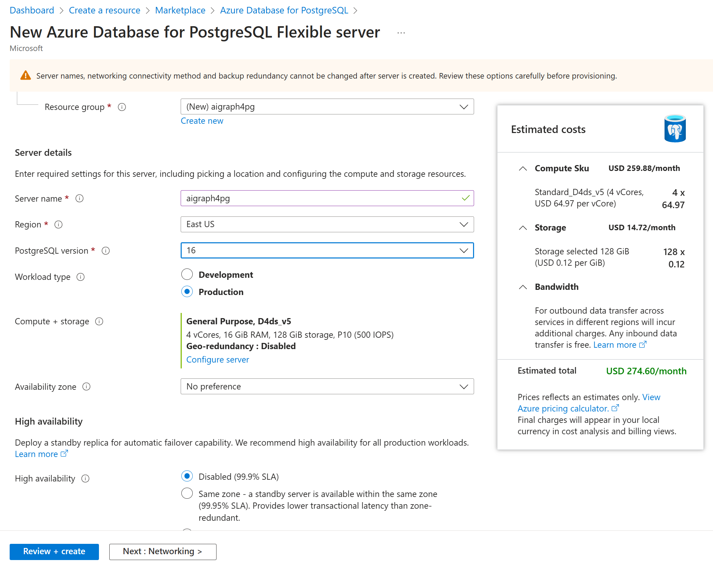
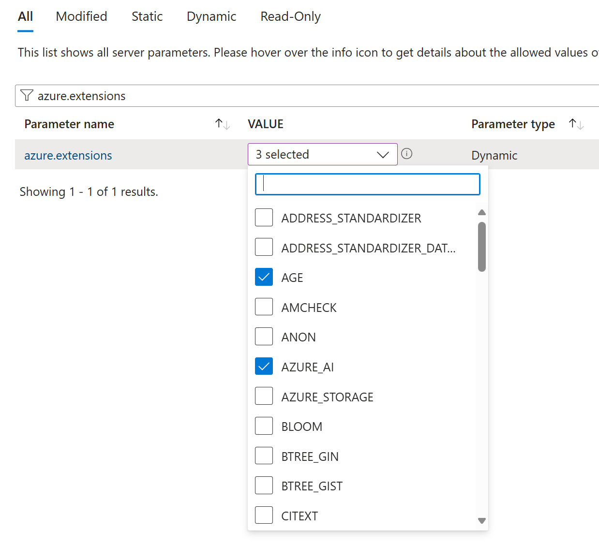
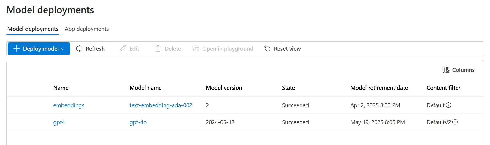
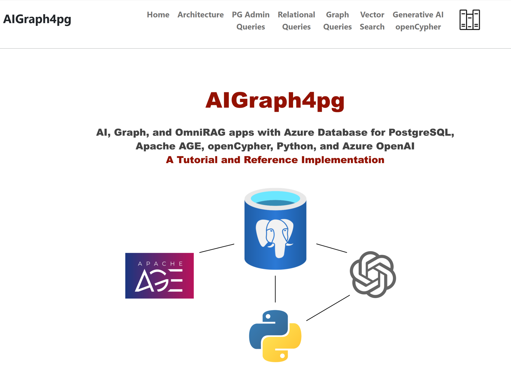
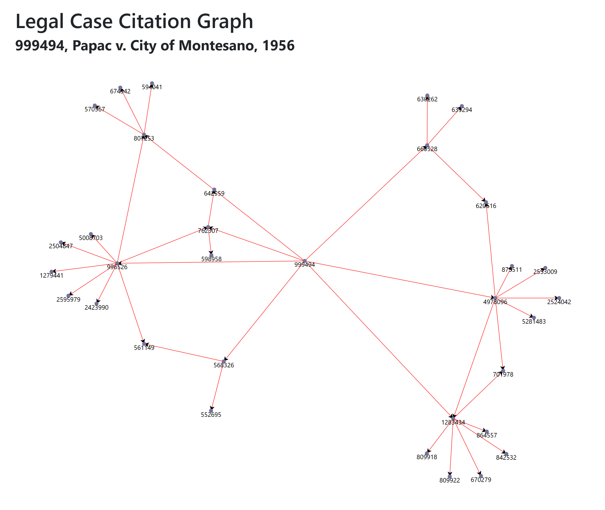

# AIGraph4pg - Documentation

## Quick Start

This section shows you how to get started with the AIGraph4pg
reference implemention.

There will be several steps to execute in this Quick Start page;
**it is NOT a "one-click" deploy process!**

### Recommended Skills

- Some programming language experience, especially with Python 3
  - See https://www.python.org/

- Some understanding of Python virtual environments
  - See https://realpython.com/python-virtual-environments-a-primer/

- Some understanding of Environment Variables

- Some command-line experience, Windows PowerShell or linux/macOS bash shell
  - https://learn.microsoft.com/en-us/powershell/scripting/overview?view=powershell-7.4 
  - https://support.apple.com/guide/terminal/welcome/mac

---

### Workstation Requirements

- **Windows 11** or recent **linux or macOS** desktop operating system
  - This solution is mostly Windows and PowerShell oriented, with *.ps1 scripts
  - But the *.sh scripts have been tested on macOS with the bash shell

- The **git** source-control system
  - Used here only to clone (i.e. - copy or download) the public GitHub repository
  - See https://git-scm.com/

- The **Azure CLI** (i.e. - az)
  - See https://learn.microsoft.com/en-us/cli/azure/
  - Used only if you with to deploy Azure PostgreSQL in an automated manner

- An **Azure Subscription**
  - Your Azure resources (i.e. - Azure PostgreSQL and Azure OpenAI) must be in a subscription.

- **Standard Python 3.12.x**
  - See https://www.python.org/downloads/
  - Not Conda or other Python distributions

- **Visual Studio Code (VSC)** or similar IDE/editor
  - See https://code.visualstudio.com/

- **A local/desktop PostgreSQL database installation**
  - See the [Installation instructions](pg_local_installation.md)
  - This includes the necessary **psql** terminal-based application

- **Docker Desktop**
  - This is optional, used only for executing the public DockerHub image
  - macOS users on Apple Silicon will have to build the Docker image for that platform

---

### Clone the GitHub repository

In Windows PowerShell, or macOS terminal, navigate to your desired
parent directory, and execute the following command to download
the reference implementation files to your computer.

```
> git clone https://github.com/cjoakim/AIGraph4pg.git
```

Then navigate into the created AIGraph4pg directory.

```
> cd AIGraph4pg

> cd data\legal_cases
```

Then **unzip** files **age_load_statments.zip** and **legal_cases.zip**
so that you now have files **age_load_statments.sql** and **legal_cases.sql**
in the same directory.

Then navigate back to the AIGraph4pg directory.

```
> cd ..\..
```

---

### Provision Azure PostgreSQL

You can use your existing **Azure Database for PostgreSQL Flexible Server**
or provision a new one to host this reference application.

Provisioning in Azure Portal is shown in the screen shot below.
You can configure a minimal server for this reference app.

<p align="center">
  
</p>

Alternatively, you can use the **az CLI** program to provision a new 
PostgreSQL Flexible Server.  PowerShell script **az/provision.ps1**
in this repo provides a working example of this.  It uses the self-explanitory
**az/provision-config-example.json** configuration file.

We recommend using a database named **dev**.

Please capture the Azure PostgreSQL server, port, database, user, and password
as you will later use these values to set the following **environment variables**
on your computer.  These are described later on this page.

```
AIG4PG_PG_FLEX_DB
AIG4PG_PG_FLEX_PASS
AIG4PG_PG_FLEX_PORT
AIG4PG_PG_FLEX_SERVER
AIG4PG_PG_FLEX_USER
```

#### Firewall Rules

After your Azure Database for PostgreSQL server has been provisioned please set the 
[Firewall Rules](https://learn.microsoft.com/en-us/azure/postgresql/flexible-server/concepts-firewall-rules) as necessary for your deployment.

#### Enable the necessary extensions

There are [many extensions](https://learn.microsoft.com/en-us/azure/postgresql/extensions/concepts-extensions-versions) that are available for Azure PostgreSQL.
PostgreSQL provides an open architecture that allows developers to extensions
these to augment PostgreSQL.

However, they must be explicitly **allowed**, by you, for your use.
This process is described here:
https://learn.microsoft.com/en-us/azure/postgresql/extensions/how-to-allow-extensions

**For this reference application, please enable these extensions:**

- **vector**   - vector search
- **age**      - Apache AGE for graph database functionality
- **azure_ai** - Microsoft extension for AI functionality

The Azure Portal UI to enable extensions looks like this:

<p align="center">
  
</p>

A future version of this reference application will use DiskANN
for vector search rather than the above vector extension.

---

### Provision Azure OpenAI

Likewise, this reference application requires access to an **Azure OpenAI** PaaS service,
either an existing or new account.  For this reference application, we recommend
simply using Azure Portal to create an Azure OpenAI PaaS service.

Within the Azure OpenAI service, you'll need to deploy two models; one for 
LLM embeddings and one for LLM completions.

For embeddings, use the **text-embedding-ada-002** model.
For completions, use the **gpt-4o** model.

The embedding model is used to create embeddings for **vector search**
while the completions model is used for **generative AI" to generate
query text from human natural-language.

Your model deployments should look similar to the following screen shot:

<p align="center">
  
</p>

These four environment variables will need to be set on your
computer so that the reference implementation code can use
your Azure OpenAI deployments.

```
AIG4PG_OPENAI_COMPLETIONS_DEP  gpt4
AIG4PG_OPENAI_EMBEDDINGS_DEP   embeddings
AIG4PG_OPENAI_KEY              <secret>
AIG4PG_OPENAI_URL              https://<your-name>.openai.azure.com/
```

Notice how the ...COMPLETIONS_DEP and ...EMBEDDINGS_DEP environment variables
refer to the **names** of the deployments rather than their actual
model names.

--- 

### Set Environment Variables

The complete set of environment variables used by this reference applicaton
are listed below.  Please set each of these per your Azure PostgreSQL and
Azure OpenAI account, as well as your resource group, region.

```
AIG4PG_AZURE_REGION            <your-preferred-azure-region>  example: eastus
AIG4PG_AZURE_RG                <your-resource-group-name>
AIG4PG_LOG_LEVEL               info   ('debug' gives more verbose web app logging)
AIG4PG_OPENAI_COMPLETIONS_DEP  <your-completions-deployment-name>
AIG4PG_OPENAI_EMBEDDINGS_DEP   <your-embeddings-deployment-name>
AIG4PG_OPENAI_KEY              <your-azure-openai-key>
AIG4PG_OPENAI_URL              https://<your-azure-openai-account-name>.openai.azure.com/
AIG4PG_PG_FLEX_DB              dev
AIG4PG_PG_FLEX_PASS            <your-azure-postgresql-key>
AIG4PG_PG_FLEX_PORT            5432
AIG4PG_PG_FLEX_SERVER          <your-azure-postgresql-server>.postgres.database.azure.com
AIG4PG_PG_FLEX_USER            <your-azure-postgresql-user-id>
```

There is a PowerShell script in this repo named **python/set-env-vars-sample.ps1**.
You can optionally edit and execute this script to set these environment variables
to **your** appropriate edited values.

For example, file set-env-vars-sample.ps1 contains the following two lines.
Replace the value "" with your Azure OpenAI key value.

```
echo 'setting AIG4PG_OPENAI_KEY'
[Environment]::SetEnvironmentVariable("AIG4PG_OPENAI_KEY", "", "User")
```

Setting these environment variables is a **one-time process**; you don't
have to do this each time you run the application.

The use of environment variables like this is typically how Docker containerized
applications are configured.  This concept is described here:
[Twelve-Factor App methodology](https://12factor.net/config),

#### The .env file

The codebase uses the **python-dotenv** library which allows you to augment
and override system environment variables.
The overrides only pertain to the python process, such as the web application.

Create and edit your own **.env** file in the **python** directory,
even if it's just an empty file.

Notice how the **.gitignore** file in this GitHub repository contains the 
following entry.  This is so that this file is not added to your source-control
system.  If you copy or fork this repository, please be sure to add a .gitignore
entry on this .env file so that your secrets aren't leaked.

```
**/.env
```

---

### Create the Python Virtual Environment

A Python Virtual Environment is an isolated location on your computer
containing a well-defined set of required libraries, defined in the 
**requirements.in** file.  The libraries are downloaded from [PyPi](https://pypi.org/).
The application code in this project then uses these Python libraries.

This is conceptually similar to NuGet (DotNet ecosystem), MavenCentral (Java ecocystem),
NPM (Node.js and JavaScript ecosystem), etc..

Execute the following commands in Windows PowerShell.
venv.ps1 will produce verbose output as the python libraries are downloaded.
Your output should look similar.

```
> cd python          <-- navigate to the python directory within the cloned repository 

python> .\venv.ps1   <-- Execute the script to create the python virtual environment

...

pip install requirements.txt ...
activating virtual environment ...
displaying python and pip versions ...
Python 3.12.7
pip list ...
Package                   Version
------------------------- -----------
ageqrp                    0.1.0
aiofiles                  23.2.1
aiohappyeyeballs          2.4.3
aiohttp                   3.10.10
...                                   many libs omitted here   
uvicorn                   0.32.0
Werkzeug                  3.0.6
wheel                     0.45.1
wsproto                   1.2.0
yarl                      1.16.0
(venv) PS ...\python>
```

#### Activate the Python Virtual Environment in Windows 11 PowerShell

```
PS ...\python>
PS ...\python> .\venv\Scripts\Activate.ps1
(venv) PS ...\python>
```

**Each time** you navigate to the python directory of this project
and want to execute a python program you will need to **"activate"** the
virtual environment, as shown below:

#### Activate the Python Virtual Environment macOS/Linux bash shell

```
[~/aigraph4pg]$ cd python
[~/aigraph4pg/python]$ source venv/bin/activate
(venv) [~/aigraph4pg/python]$
```

Notice how when the Virtual Environment is activated your shell
prompt changes to have the **(venv)** prefix.
This is a useful visual cue.

---

### Prepare your Azure PostgreSQL Flexible Server

The repo contains scripts named **pg.ps1** (Windows) and **pg.sh** (macOS/Linux)
that are wrappers for the **psql** shell program.  These pg.xx scripts
use your above-defined environment variables so as to make psql
easier to use.

For example, to create a psql shell that connects to the **postgres**
database of your Azure Database for PostgreSQL Flexible Server:

```
> .\pg.ps1 flex postgres

psql (16.6, server 16.4)
Type "help" for help.

postgres=>
```

Notice how your psql prompt is **postgres=>** because that's the database
you're currently in.

#### Create a logon role, and database owned by the role

Note: please change the user value below to your chosen role name!
Likewise, create your own password value.

```
postgres=# create role <user> with createdb login password '<your-password>';
CREATE ROLE

postgres=# create database dev owner <user>;
CREATE DATABASE
```

If you need to later change your password, you can do it 
within psql with this command:

```
alter user <user> with password '<new-password>';
```

### Create extensions

In the above section on provisioning and configuring Azure PostgreSQL,
several extensions were enabled in the Azure Portal UI.
In this section we will start to use those enabled extensions.

Connect to your new **dev** database (or an alternative name of your choice).
Notice how the prompt changes to **dev=>***

```
postgres=> \connect dev

dev=>
```

#### Create the vector and age extensions

This enables vector search functionality and Apache AGE graph functionality.

Note: Vector search with **DiskANN** will be described in this repo soon;
late December 2024.

```
dev=> CREATE EXTENSION IF NOT EXISTS vector CASCADE;
dev=> CREATE EXTENSION IF NOT EXISTS age CASCADE;
dev=> CREATE EXTENSION IF NOT EXISTS azure_ai CASCADE;
```

Next, confirm that the extensions are installed:

```
dev=> SELECT extname, extversion FROM pg_extension;
 extname  | extversion
----------+------------
 plpgsql  | 1.0
 vector   | 0.7.0
 age      | 1.5.0
 azure_ai | 1.1.0
(4 rows)
```

Next, set the search_path for your role/user to include Apache AGE.
This will make subsequent psql and programatic access to the
Azure PostgreSQL database easier.

```
dev=> alter user <user> set search_path='public','ag_catalog';
```

### Create the Apache AGE "legal_cases" graph

```
SELECT ag_catalog.create_graph('legal_cases');
```

Then, confirm that the new graph exists with this query:

```
dev=> SELECT * FROM ag_catalog.ag_graph;
 graphid |    name     |  namespace
---------+-------------+-------------
  123351 | legal_cases | legal_cases
(1 row)
```

Finally, close your psql session, for now, with the \q command.

```
dev=> \q
```

A graph can be deleted with this command:

```
SELECT * FROM ag_catalog.drop_graph('graph_name', true);
```

---

### Delete/Define and Load the legal_cases relational table

At this point per these instructions, the following should have been completed:

- Your Azure PaaS services have been created
- Your workstation/laptop has the necessary programs installed
- Your workstation/laptop has the necessary environment variables
- Your workstation/laptop has the cloned/downloaded GitHub repository files
- Your Python Virtual Environment has been created
- The PostgreSQL user role has been created, with AGE search_path
- Your "dev" database has been created
- Your "legal_cases" Apache AGE graph has been created

It's now to time to populate your Azure PostgreSQL database and AGE graph.

---

### Delete/Define and Load the legal_cases Apache AGE graph

Return to the python\ directory, with an active python virtual environment,
and execute the following command.

```
(venv) PS ...\python> python main.py delete_define_legal_cases_table
```

This will execute the commands in file **sql/legal_cases_ddl.sql**
in your database.  It creates the **legal_cases** table and the
necessary indexes, including an xxx index index for vector search.

The **legal_cases table** has the following structure.
Note that is has conventional columns, as well as a **JSONB**
column and a **vector** column which contains embeddings
with 1536 dimensions.  The value in the text_data column
was used to previously create the embedding values via
the Azure OpenAI SDK.  Therefore, you don't need to "vectorize"
this dataset as it "ships" with the vectors/embeddings included.

```
CREATE TABLE legal_cases (
    id                   bigserial primary key,
    name                 VARCHAR(1024),
    name_abbreviation    VARCHAR(1024),
    case_url             VARCHAR(1024),
    decision_date        DATE,
    court_name           VARCHAR(1024),
    citation_count       INTEGER,
    text_data            TEXT,
    json_data            JSONB,
    embedding            vector(1536)
);
```

In another PowerShell or Terminal tab, connect to your database
with psql, and verify that the legal_cases table exists:

```
dev=> \d legal_cases
                                          Table "public.legal_cases"
      Column       |          Type           | Collation | Nullable |                 Default
-------------------+-------------------------+-----------+----------+-----------------------------------------
 id                | bigint                  |           | not null | nextval('legal_cases_id_seq'::regclass)
 name              | character varying(1024) |           |          |
 name_abbreviation | character varying(1024) |           |          |
 case_url          | character varying(1024) |           |          |
 decision_date     | date                    |           |          |
 court_name        | character varying(1024) |           |          |
 citation_count    | integer                 |           |          |
 text_data         | text                    |           |          |
 json_data         | jsonb                   |           |          |
 embedding         | vector(1536)            |           |          |
Indexes:
    "legal_cases_pkey" PRIMARY KEY, btree (id)
    "idx_legal_cases_citation_count" btree (citation_count)
    "idx_legal_cases_court_name" btree (court_name)
    "idx_legal_cases_decision_date" btree (decision_date)
    "idx_legal_cases_ivfflat_embedding" ivfflat (embedding vector_cosine_ops) WITH (lists='50')
    "idx_legal_cases_json_data_gin" gin (json_data)
    "idx_legal_cases_name_abbreviation" btree (name_abbreviation)
```

#### Load the legal_cases table

Navigate to the python\ directory of this repository and 
execute the following command.

```
python> .\pg.ps1 flex dev
```

In the **interactive psql shell** run the following command:

```
dev=> \copy legal_cases FROM '<filename>' DELIMITER E'\t'
COPY 2679
```

Where <filename> is the fully qualified filename of the **legal_cases.sql**
file on your computer.  On my computer, it has this filename:

```
C:\Users\chjoakim\github\AIGraph4pgPrivate\data\legal_cases\legal_cases.sql
```

This output indicates that 2679 rows were inserted into the table.

---

### Load the legal_cases Apache AGE graph

Navigate to the python\ directory of this repository and 
execute the following command.

It will run the **psql** program in **batch mode** and use
as input the age_load_statments.sql file.

This process may take approximately 10-minutes depending on
your computer and network bandwidth.

```
python> .\pg.ps1 flex dev ..\data\legal_cases\age_load_statments.sql
```

File **age_load_statments.sql** contains SQL commands that
create both the **vertices** then the **edges** of the legal_cases
graph.

In this reference application dataset there is a 1:1 correlation
between the rows of the legal_cases **relational table** and the
vertices in the legal_cases **graph**.

---

### Execute the Web UI Application

This is the easy part.

In the python\ directory activate the virtual environment and run
the following command:

```
(venv) PS ...\python> .\webapp.ps1
```

Then visit URL **http://localhost:8000/** with your browser and
you'll see the running web application similar to the following image:

<p align="center">
  
</p>

### Notes on Using the Web UI

The UI is intentionally primitive and simple.  It is designed as a learning
tool and for providing a working codebase rather than a full-featured
and polished business application.

Topics are presented in generally increasing complexity from **left-to-right**
in the **Top-Navigation** area of the page.

<p align="center">
  
</p>

- The **Architecture** page described the architecture of the reference app
and potential customer use of this architecture.

- The **PG Admin Queries** page demonstrates some of the breadth of
the PostgreSQL ecosystem in that Azure PostgreSQL itself is queryable
and highly configurable.

- The **Relational Queries** page demonstrates several queries of
the legal_cases table, including interesting JSONB functionality.

- The **Graph Queries** page demonstrates graph queries with 
the **openCypher** query language vs the legal_cases graph.
Some of the listed queries produce **graph visualizations with D3.js**.
See below.

- The **Vector Search** page currently executes vector searches
of the legal_cases relational table with the pgvector extension.
This will be enhanced, in late December 2024, to use **DiskANN**
for vector search.

- The **Generative AI** page is a work-in-progress.  It will demonstrate
how to use a LLM and generative AI to produce openCypher query syntax
from user specified "natural langage".

- **Important Note: Tutorial content** is available for each page
by **clicking the books icon** at on the right side of the **Top-Navigation**.

### Graph Visualizations

Several of the example openCypher queries in the Graph Queries page
produce visualizations of the graph query results.  These show the
**relationships or edges** between the legal case **vertices**
where one case cites another case.

The [D3.js](https://d3js.org/) JavaScript library is used in this
reference application because D3 is free, open-source, and is widely used.
D3.js provides an extensive API, and the visualizations are interactive.
In this implementation when you click a legal case vertex the name
of that case is displayed.  The visualization can also be dragged and
resized.

<p align="center">
  
</p>
